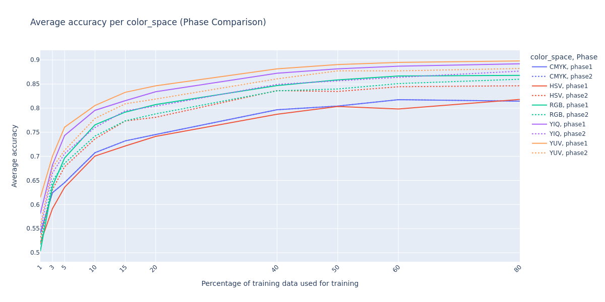
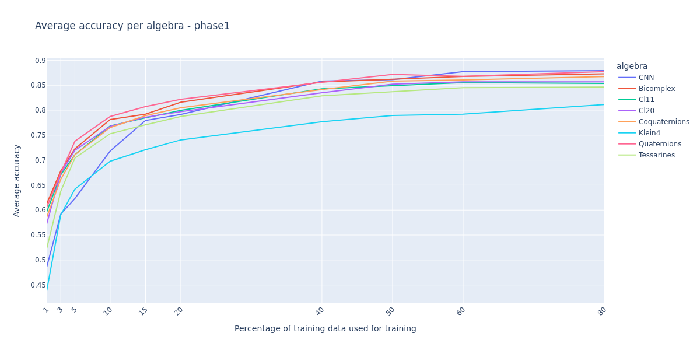
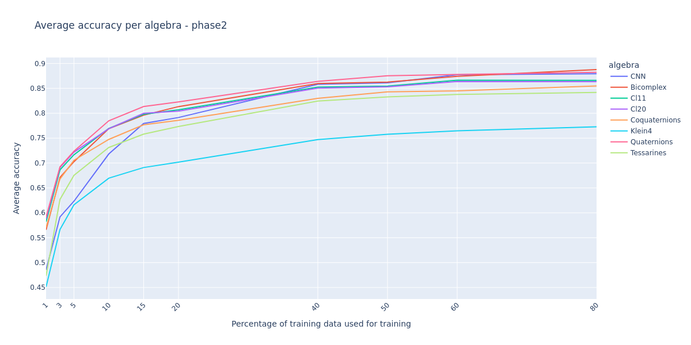

# Color spaces

## Color space transformations conclusions

### RGB

Better results achieved in:  
`Phase1` HCNN: A fourth channel filled with zeros is added to match hypercomplex representation.

### HSV

Better results achieved in:  
`Phase2` HCNN: The channels are split into **(V, S * cos(θ), S * sin(θ), V * cos(θ))** where θ = H * 2π.

### YUV

Better results achieved in:  
`Phase1` HCNN: A fourth channel filled with zeros is added to match hypercomplex representation.

### YIQ

Better results achieved in:  
`Phase1` HCNN: A fourth channel filled with zeros is added to match hypercomplex representation.

### CMYK

Both phases used the same transformation.

## Color space type conclusions

Ranking from best to worst:

1. YUV
2. YIQ
3. RGB
4. HSV
5. CMYK (worst by far)

**Final conclusion - CMYK will be removed from the next phase to reduce training complexity.**

# Algebra types

**Final conclusion - Klein4 will be removed from the next phase to reduce training complexity.**

