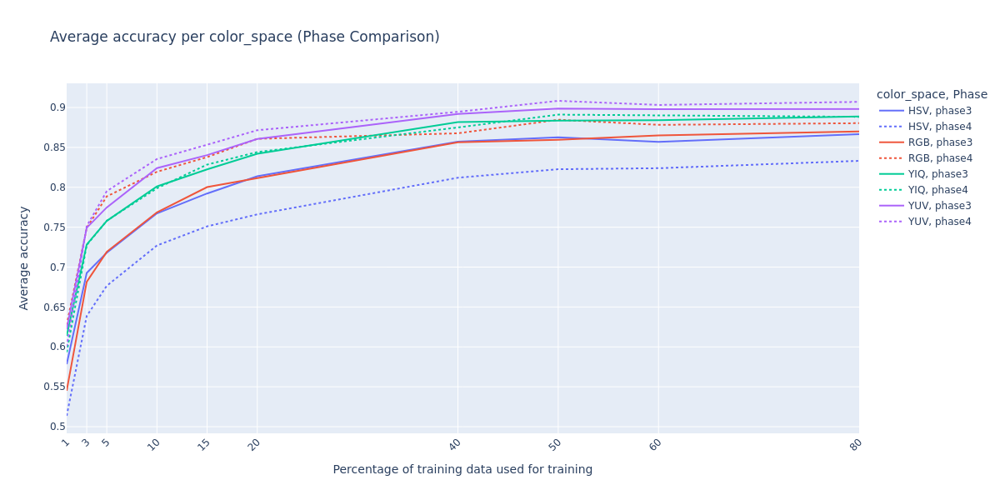
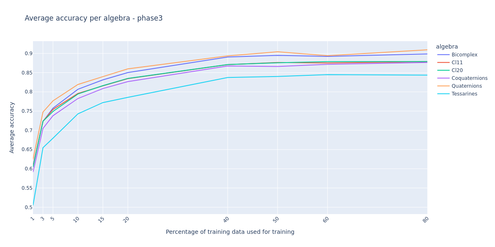
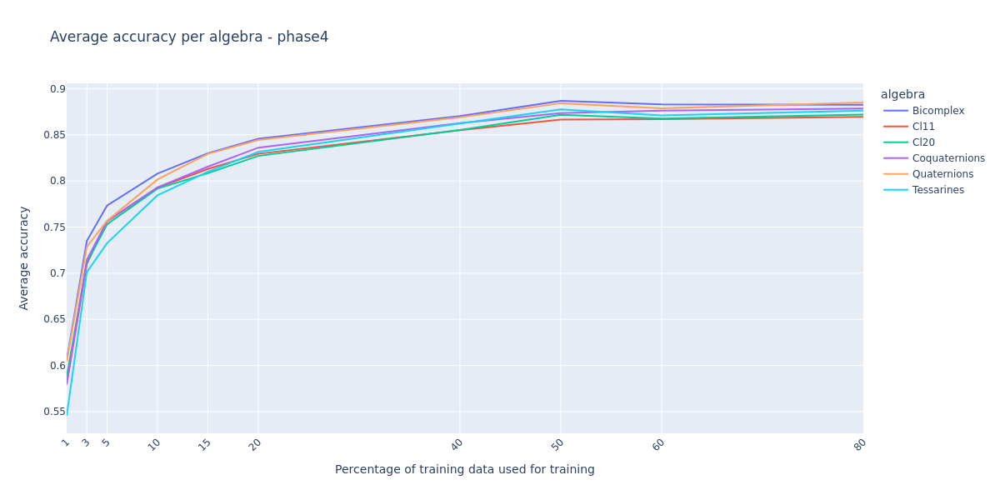

# Color spaces

## Color space transformations conclusions

### RGB

Better results achieved in:  
`Phase4` HCNN: The channels are split into **(log(1 + Magnitude), Phase RG, Phase RB, Magnitude * cos(Phase RG + Phase
RB))** where Magnitude = sqrt(R² + G² + B²).

### HSV

Better results achieved in:  
`Phase3` HCNN: The channels are split into **(V, S * cos(θ), S * sin(θ), V * cos(θ))** where θ = H * 2π.

### YUV

Better results achieved in:  
`Phase4` HCNN: The channels are split into **(Y, Magnitude * cos(2θ), Magnitude * sin(2θ, exp(-Magnitude))** where θ =
H * 2π and Magnitude = sqrt(U² + V²).

### YIQ

Better results achieved in:  
`Phase4` HCNN: The channels are split into **(Y, Magnitude * cos(2θ), Magnitude * sin(2θ, exp(-Magnitude))** where θ =
H * 2π and Magnitude = sqrt(I² + Q²).

## Color space type conclusions

Ranking from best to worst:

1. YUV
2. YIQ/RGB (approximately RGB better for 1-30% training split, YIQ better for 40-80% training split)
3. HSV

**Final conclusion - All color spaces will be retained for further analysis.**

# Algebra types

**Final conclusion - In Phase 4, all algebra types achieve similar results - further analysis is required.**

