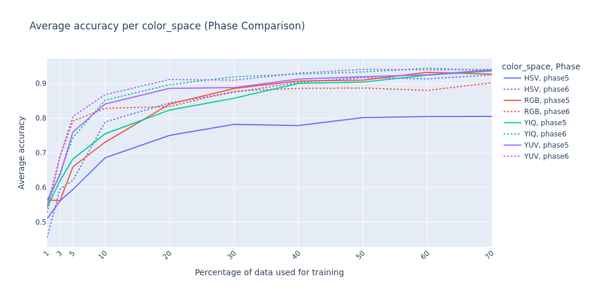
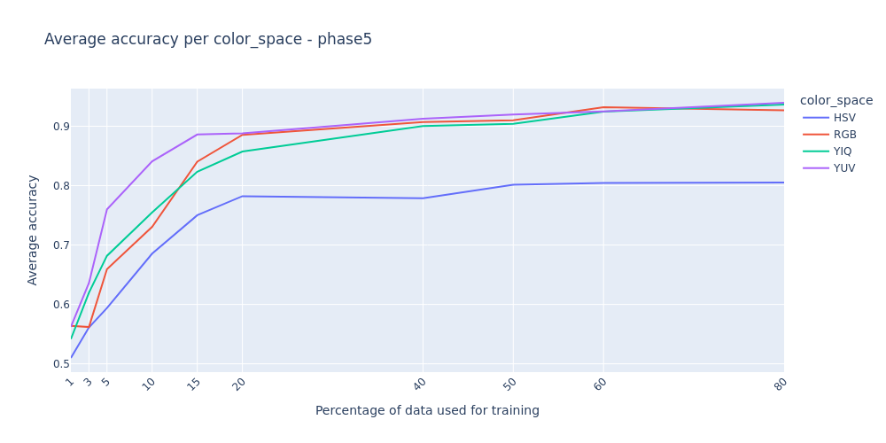
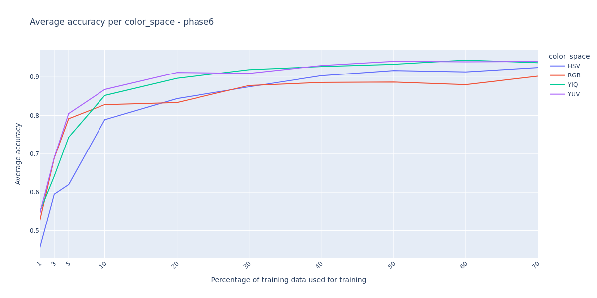

# Color spaces

## Color space transformations conclusions

### RGB

Depending on the proportion of the training set used, the results for RGB varied. For the range of 1-20%, much better
results were achieved for the colour space after transformation to 4 dimensions. For the range 20-70%, the results were slightly
better for the colour space without transformations. It was decided to leave the colour space untransformed, as the 
discrepancies are not that significant, and it will provide a good reference value for HCNN models against the most 
classical RGB approach without additional transformations.

In future phases, the RGB colour space will be used without transformations as in `Phase5`.

### HSV

Better results achieved in:  
`Phase6` The channels are split into **(V, exp(S) * cos(θ), exp(S) * sin(θ), sin(V * π))** where θ = H * 2π.

### YUV

Better results achieved in:  
`Phase6` The channels are split into **(Y, Magnitude * cos(2θ), Magnitude * sin(2θ, exp(-Magnitude))** where θ =
atan2(V, U) and Magnitude = sqrt(U² + V²).

### YIQ

Better results achieved in:  
`Phase6` The channels are split into **(Y, Magnitude * cos(2θ), Magnitude * sin(2θ, exp(-Magnitude))** where θ =
atan2(I, Q) and Magnitude = sqrt(I² + Q²).

## Color space type conclusions

Ranking from best to worst (approximately):

1. YUV
2. YIQ
3. RGB 
4. HSV

**Final conclusion - All color spaces will be retained for further analysis.**

# Separate charts for color space comparison

**Final conclusion - In Phase 4, all algebra types achieve similar results - further analysis is required.**

