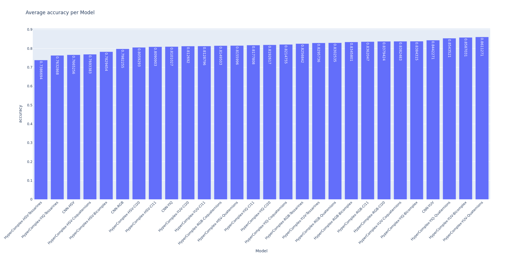

It was decided to select the 7 best per algebra models for further analysis. The selected models are:

- HyperComplex-YUV-Bicomplex (top 1 - avg accuracy: 0.862)
- HyperComplex-YUV-Quaternions (top 2 - avg accuracy: 0.86)
- CNN-YUV (top 4 - avg accuracy: 0.854)
- HyperComplex-YUV-Coquaternions (top 6 - avg accuracy: 0.841)
- HyperComplex-RGB-Cl20 (top 7 - avg accuracy: 0.838)
- HyperComplex-RGB-Cl11 (top 9 - avg accuracy: 0.836)
- HyperComplex-YUV-Tessarines (top 10 - avg accuracy: 0.833)
- CNN-RGB (top 23 - 0.785)

CNN-RGB was kept as a reference to most classical models. The selected models will be further analyzed in the next phase.